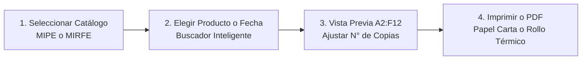

# 🏷️ ETIQUETA LABEL
### Sistema de Impresión y Control de Etiquetas SGA / GHS para Fitosanitarios y Fertirriego


---

## 📌 ¿Qué es ETIQUETA LABEL?

**ETIQUETA LABEL** es una plataforma web rápida y moderna diseñada para estaciones de mezclas, bodegas y salas de fertirriego en fincas agrícolas. 

Permite leer las programaciones y bases de datos en **Microsoft Excel** y generar al instante las **etiquetas oficiales del Sistema Globalmente Armonizado (SGA / GHS)** con la **estructura exacta de la plantilla física de Excel (`A2:F12`)**, listas para imprimir en impresoras convencionales o térmicas.

---

## 🎯 Principales Beneficios

- 🔄 **Conexión Directa con Excel:** El personal agronómico sigue usando y actualizando sus archivos de Excel habituales (`Base.xlsx` y `aplicacion.xlsm`). La web detecta los cambios automáticamente sin bloquear los archivos.
- 🧪 **Cálculo Automático de Tanques de 1,000 L y Colitas:** Desglosa grandes volúmenes en tanques estándar de 1,000 L y calcula automáticamente el remanente exacto ("colita") con su dosificación proporcional.
- 🏷️ **Réplica Exacta de la Plantilla Física (A2:F12):** Conserva la cuadrícula oficial de 6 columnas con pictogramas normativos en diamante rojo, palabras de advertencia (`PELIGRO` / `ATENCIÓN`), dosis, intervalos de reentrada y frases H/P completas.
- 🖨️ **Impresión Rápida y Exportación a PDF:** Imprime directo desde el navegador o genera archivos PDF vectoriales en hoja Carta o rollo térmico continuo (Zebra, TSC, Xprinter, Epson).
- 📋 **Trazabilidad y Auditoría (ICA / GlobalGAP):** Registra de forma inmutable cada impresión, operario, producto y lote para auditorías fitosanitarias.
- 📱 **Acceso Multi-dispositivo:** Funciona en computadoras, tablets y teléfonos celulares conectados al Wi-Fi de la finca.

---

## 🌿 Catálogos Normativos Disponibles

La aplicación cuenta con un selector principal para alternar entre los dos programas de la finca:

1. 🛡️ **MIPE (Catálogo Fitosanitarios):**
   - Catálogo oficial normativo SGA 2025 (`BD_INFORMACION_ETIQUETAS_SGA_2025.xlsx` / `Base.xlsx`).
   - Fichas completas para productos de control de plagas y enfermedades con pictogramas GHS y frases de seguridad.

2. 💧 **MIRFE (Catálogo Fertirriego):**
   - Base de datos maestra de nutrición vegetal y fertilizantes (`Base_Actualizada.xlsx`).
   - Dosificaciones para sistemas de riego por goteo e hidroponía.

---

## 🚀 Inicio Rápido (En 1 Clic)

### Opción 1: En Windows (Doble Clic)
1. Haz doble clic en el archivo **`ABRIR_ETIQUETAS.bat`** (o `run_app.bat`).
2. Se abrirá automáticamente tu navegador en:
   👉 **`http://localhost:8000`**

### Opción 2: Desde la Terminal
```bash
# 1. Instalar dependencias (solo la primera vez)
pip install -r requirements.txt

# 2. Iniciar el servidor
python app.py
```

### Usuarios de Acceso Predeterminados:
| Rol | Usuario | Contraseña Inicial |
| :--- | :--- | :--- |
| **Administrador** | `admin` | `admin123` |
| **Operario de Mezclas** | `operario` | `operario123` |

*(Por seguridad, el sistema solicitará cambiar la contraseña en el primer inicio de sesión).*

---

## 📖 Cómo Usar la Aplicación (Paso a Paso)



1. **Selecciona el Catálogo:** En la barra superior elige **MIPE** (Fitosanitarios) o **MIRFE** (Fertirriego).
2. **Busca o Filtra:** Usa la barra de búsqueda rápida o selecciona una fecha específica de aplicación.
3. **Ver Plantilla:** Haz clic en **"Ver Plantilla Excel"** en cualquier producto para inspeccionar la etiqueta en el visor derecho.
4. **Imprime:** 
   - Elige la cantidad de copias con los botones **`+`** / **`-`**.
   - Haz clic en **"Imprimir Vista Previa"** o **"Exportar PDF"**.

---

## 🖨️ Formatos de Impresión Soportados

| Formato | Tipo de Impresora | Uso Recomendado |
| :--- | :--- | :--- |
| **Hoja Carta (2 columnas)** | Impresoras láser / inyección (papel bond o adhesivo) | Máximo ahorro de papel: entran de 4 a 6 etiquetas por hoja para recortar. |
| **Rollo Térmico (100 × 150 mm)** | Impresoras térmicas (Zebra, TSC, Xprinter, Honeywell) | 1 etiqueta autoadhesiva directa por tanque. |
| **PDF Vectorial Oficial** | Cualquier dispositivo | Documento digital de alta resolución para archivo o envío por correo. |

---

## 📂 Estructura del Proyecto

```text
etiquetas_app/
├── ABRIR_ETIQUETAS.bat       # Lanzador principal en Windows (1 clic)
├── app.py                    # Servidor backend en FastAPI
├── requirements.txt          # Dependencias de Python
├── Dockerfile                # Configuración para despliegue en la nube
├── render.yaml               # Despliegue automático en Render.com
│
├── backend/                  # Motores de cálculo y lógica de negocio
│   ├── data_loader.py        # Lector inteligente de Excel y auto-recarga
│   ├── ghs_engine.py         # Inferencia y validación de pictogramas GHS
│   ├── pdf_generator.py      # Generador de PDF vectorial (ReportLab)
│   ├── security.py           # Autenticación, contraseñas seguras y sesiones
│   └── audit_logger.py       # Registro SQLite para auditorías ICA/GlobalGAP
│
├── static/                   # Interfaz de usuario web
│   ├── index.html            # Estructura principal y modales
│   ├── app.js                # Lógica del frontend y renderizado reactivo
│   ├── styles.css            # Estilos y réplica de plantilla Excel A2:F12
│   ├── favicon.svg           # Ícono vectorial de la marca
│   ├── img/logo.svg          # Logotipo oficial ETIQUETA LABEL
│   └── picto/                # Pictogramas normativos oficiales GHS01 a GHS09
│
├── data/catalog/             # Archivos Excel de catálogo incluidos
└── tests/                    # Pruebas unitarias automatizadas
```

---

## 🧪 Verificación y Pruebas Automatizadas

El proyecto incluye pruebas unitarias para garantizar el cumplimiento de reglas de negocio:

```bash
python -m unittest discover -s tests -p "test_*.py"
```

**Resultado esperado:**
```text
...........
----------------------------------------------------------------------
Ran 11 tests in 4.5s - OK
[TEST PASS] Regla de 162,600 L desglose exacto (162 tanques 1,000L + 1 colita 600L).
[TEST PASS] Inferencia GHS verificada (Frases H -> Pictogramas).
[TEST PASS] Generación de PDF vectorial y compatibilidad de catálogos verificada.
```

---

## ☁️ Despliegue en la Nube (Opcional)

Si deseas acceder a la plataforma desde fuera de la finca:
1. Crea una cuenta en [Render.com](https://render.com) e inicia sesión con tu GitHub.
2. Haz clic en **New + > Web Service** y selecciona tu repositorio: `bell77-t/etiquetas-sga`.
3. Render detectará automáticamente el archivo `render.yaml` y desplegará la web con enlace HTTPS en 2 minutos.

---

## 📄 Normativas de Cumplimiento
- **Decreto 1496 de 2018**: Adopción del Sistema Globalmente Armonizado (SGA / GHS) en Colombia.
- **Resolución ICA 07723 de 2020**: Buenas Prácticas Agrícolas y registro de aplicaciones fitosanitarias.
- **Norma GlobalGAP IFA v6**: Trazabilidad documental completa de insumos químicos en campo.
